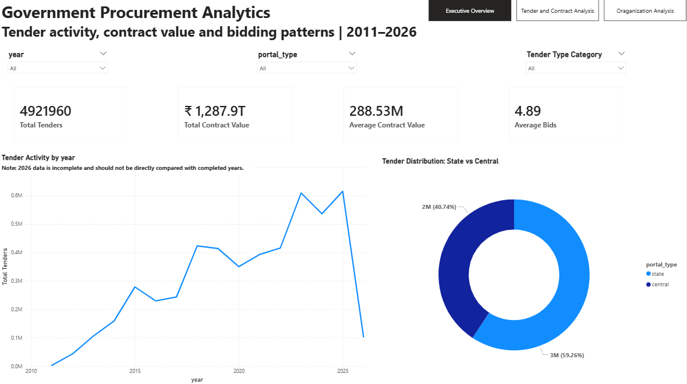

# Government Procurement Analytics
An end-to-end data analytics project using Python, SQL and Power BI to analyze government tender activity, contract values, tender types and bidding patterns.

## Project Overview

This project is based on a real-world government procurement dataset containing around 4.9 million tender records.

The main goal of this project was to understand:
- How tender activity changed over the years
- How tenders are distributed between State and Central portals
- What types of tenders are recorded in the data
- Which organizations have the highest number of tenders
- How contract values are distributed
- How many bids are received for tenders
- Whether there is any relationship between contract value and number of bids

The project covers the complete process from data cleaning and analysis to SQL analysis and an interactive Power BI dashboard.

## Tools & Technologies

- **Python** – Data cleaning and exploratory data analysis
- **SQL** – Data analysis and business questions
- **Power BI** – Interactive dashboard and visualization
- **Pandas** – Data manipulation and cleaning
- **Matplotlib** – Data visualization
- **MySQL** – SQL analysis
- **DuckDB** – Used to work efficiently with the large dataset

## Dataset

The dataset is based on government procurement data from the Central Public Procurement Portal (CPPP).
The data was collected and published as a public dataset by Sarthak Sidhant.
The database contains multiple tables. For this project, I mainly worked with:

- `aoc_tenders` – tender-level information such as tender ID, year, dates, portal type and organization
- `aoc_details` – additional tender details stored in JSON format

The two tables were combined using `internal_id`.

The final dataset contained **4,921,960 tender records**.

## Data Cleaning

The raw dataset had missing values, inconsistent values and some date issues, so I cleaned the data before starting the analysis.

The main cleaning steps were:

- Checked the shape, columns, data types and sample records
- Checked missing values across the dataset
- Removed columns that were not required for the analysis
- Checked for duplicate records
- Converted date columns to proper datetime format
- Handled invalid and placeholder dates
- Cleaned text and categorical columns
- Standardized tender type values where possible
- Checked for negative and zero values
- Checked extreme contract values and number of bids
- Checked relationships between important date columns
- Rechecked the dataset after cleaning

No artificial values were added to fill important missing data. Missing values were kept where the original data did not provide a reliable value.

## Exploratory Data Analysis

After cleaning the data, I used Python to explore the dataset and understand the main patterns.

The main questions I looked at were:

- How has tender activity changed over the years?
- How are tenders split between State and Central portals?
- What are the most common tender types?
- Which organizations have the highest number of tenders?
- How are contract values distributed?
- Which organizations have the highest total contract value?
- How many bids are received for tenders?
- Is there a relationship between contract value and number of bids?

The EDA helped me understand the data before moving into detailed SQL analysis and Power BI reporting.

## SQL Analysis

I used MySQL to answer business questions from the cleaned dataset.

Some of the analysis included:

- Tender count by year
- State vs Central tender distribution
- Highest and lowest tender activity by year
- Year-over-year tender changes using `LAG()`
- Tender type analysis using `CASE`
- Top organizations by tender count
- Top organizations by total contract value
- Average contract value by year and tender type
- Average number of bids by tender type
- Bid distribution using bid buckets
- Organization-level bidding analysis
- Yearly State vs Central percentage distribution

I also used indexes on frequently grouped columns to improve query performance while working with the large dataset.

## Power BI Dashboard

I created a 3-page interactive Power BI dashboard to present the main findings from the analysis.

### 1. Executive Overview
- Total tenders
- Total contract value
- Average contract value
- Average bids
- Tender activity by year
- State vs Central tender distribution

### 2. Tender & Contract Analysis
- Tender distribution by type
- Recorded contract value by year
- Average bids by tender type

### 3. Organization Analysis
- Top 10 organizations by tender count
- Top 10 organizations by recorded contract value
- Top 10 organizations by average bids

The dashboard also includes slicers for **Year, Portal Type and Tender Type Category**. These slicers are synced across the three pages so the report can be explored interactively.

## Key Findings

Some of the main findings from the analysis were:

- The dataset contains **4,921,960 tender records** covering the years 2011 to 2026.
- **2025** had the highest number of recorded tenders with **615,047** tenders.
- State portals accounted for around **59.3%** of the tenders, while Central portals accounted for around **40.7%**.
- **West Bengal** had the highest number of recorded tenders among organizations, followed by Maharashtra and Kerala.
- Madhya Pradesh had the highest total recorded contract value among organizations in the dataset.
- The contract value data was highly skewed, with a small number of very large contract values.
- Most tenders had between **1 and 3 bids**.
- The number of bids varied considerably across tender types and organizations.
- The 2026 data is incomplete, so it should not be directly compared with completed years.

## Project Structure

```text
government-procurement-analytics/
│
├── sql/
│   └── Procurement_data.sql
│
├── screenshots/
│   └── Power BI dashboard screenshots
│
└── README.md
The cleaned dataset and Power BI file are not included in the repository because of their large file sizes.
```


## Power BI Dashboard

### Executive Overview



### Tender & Contract Analysis


### Organization Analysis


